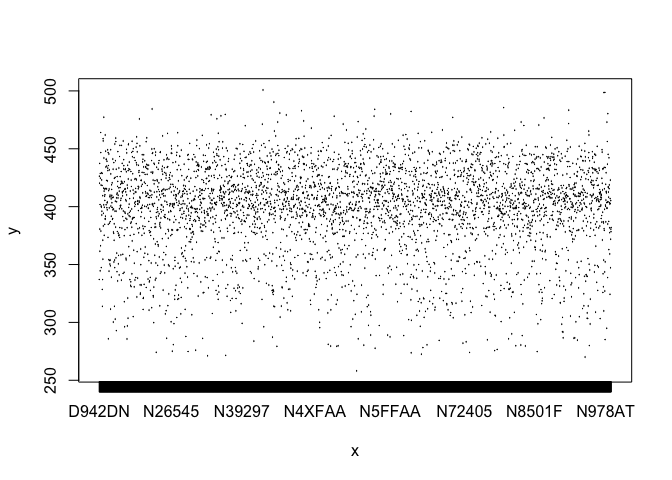

Midterm.
--------

#### 1. Map the delay by destination.

Compute the average delay by destination, then join on the airports data
frame so you can show the spatial distribution of delays. Here’s an easy
way to draw a map of the United States. You are welcome to use this code
or some other code.

    library(tidyverse)

    ## ── Attaching packages ────────────────────────────────────────────────────────────────────────────────────── tidyverse 1.3.0 ──

    ## ✓ ggplot2 3.2.1     ✓ purrr   0.3.3
    ## ✓ tibble  2.1.3     ✓ dplyr   0.8.4
    ## ✓ tidyr   1.0.2     ✓ stringr 1.4.0
    ## ✓ readr   1.3.1     ✓ forcats 0.4.0

    ## ── Conflicts ───────────────────────────────────────────────────────────────────────────────────────── tidyverse_conflicts() ──
    ## x dplyr::filter() masks stats::filter()
    ## x dplyr::lag()    masks stats::lag()

    library(nycflights13)

    airports %>%
      semi_join(flights, c("faa" = "dest")) %>%
      ggplot(aes(lon, lat)) +
      borders("state") +
      geom_point() +
      coord_quickmap()

    nycflights_new_1 = nycflights13::flights %>% group_by(dest) %>% summarise(avg_delay = mean(arr_delay))
    nycflights_new_1

    ## # A tibble: 105 x 2
    ##    dest  avg_delay
    ##    <chr>     <dbl>
    ##  1 ABQ        4.38
    ##  2 ACK       NA   
    ##  3 ALB       NA   
    ##  4 ANC       -2.5 
    ##  5 ATL       NA   
    ##  6 AUS       NA   
    ##  7 AVL       NA   
    ##  8 BDL       NA   
    ##  9 BGR       NA   
    ## 10 BHM       NA   
    ## # … with 95 more rows

    #nycflights_new_1 %>% semi_join(airports, c("faa" = "dest"))

You might want to use the size or colour of the points to display the
average delay for each airport.

    airports %>% geom_point(mapping = aes(color = nycflights_new_1$avg_delay))

    ## mapping: colour = ~nycflights_new_1$avg_delay 
    ## geom_point: na.rm = FALSE
    ## stat_identity: na.rm = FALSE
    ## position_identity

#### 2. Do planes trade ownership?

You might expect that there’s an implicit relationship between plane and
airline, because each plane is flown by a single airline. Confirm or
reject this conjecture using data.

    unique = nycflights13::planes %>% left_join(flights) %>% count(tailnum)

    ## Joining, by = c("tailnum", "year")

    which(unique$n != 1)

    ##  [1]  216  217  219  222  224  229  231  234  419  422  579  585  601  611  629
    ## [16]  631  634  637  640  643  646  651  844  849  860  876  891  892  893  909
    ## [31]  957  978  979  980  982  983  984  990 1004 1059 1060 1084 1089 1093 1097
    ## [46] 1105 1111 1148 1161 1174 1185 1208 1215 1224 1242 1249 1697 1703 1708 1714
    ## [61] 1719 1720 1998 2086 2087 2163 2164 2165 2166 2185 2186 2619 2624 2676 2788
    ## [76] 2789 2790 2791 2793 2794 2795 2796 2797 2798 2799 2802 2803 2920 2946 2983

**Claim is not correct since there are multiple planes that have a count
of more than 1**

#### 3. Plane's average speed.

Notice that `flights$air_time` is in minutes. Make a new column that is
the air time in hours.

    nycflights_new = nycflights13::flights %>% mutate(air_time_hours = air_time/60)
    nycflights_new

    ## # A tibble: 336,776 x 20
    ##     year month   day dep_time sched_dep_time dep_delay arr_time sched_arr_time
    ##    <int> <int> <int>    <int>          <int>     <dbl>    <int>          <int>
    ##  1  2013     1     1      517            515         2      830            819
    ##  2  2013     1     1      533            529         4      850            830
    ##  3  2013     1     1      542            540         2      923            850
    ##  4  2013     1     1      544            545        -1     1004           1022
    ##  5  2013     1     1      554            600        -6      812            837
    ##  6  2013     1     1      554            558        -4      740            728
    ##  7  2013     1     1      555            600        -5      913            854
    ##  8  2013     1     1      557            600        -3      709            723
    ##  9  2013     1     1      557            600        -3      838            846
    ## 10  2013     1     1      558            600        -2      753            745
    ## # … with 336,766 more rows, and 12 more variables: arr_delay <dbl>,
    ## #   carrier <chr>, flight <int>, tailnum <chr>, origin <chr>, dest <chr>,
    ## #   air_time <dbl>, distance <dbl>, hour <dbl>, minute <dbl>, time_hour <dttm>,
    ## #   air_time_hours <dbl>

#### 4. Average speed

For each flight, compute the average speed of that flight (in miles per
hour). Then, for each plane, compute the average of those average
speeds. Display it in a histogram. You can use a base R histogram `hist`
or ggplot's `geom_histogram`.

    nycflights_new_2 = nycflights_new %>% mutate(avg_speed = distance/air_time_hours)
    nycflights_new_2

    ## # A tibble: 336,776 x 21
    ##     year month   day dep_time sched_dep_time dep_delay arr_time sched_arr_time
    ##    <int> <int> <int>    <int>          <int>     <dbl>    <int>          <int>
    ##  1  2013     1     1      517            515         2      830            819
    ##  2  2013     1     1      533            529         4      850            830
    ##  3  2013     1     1      542            540         2      923            850
    ##  4  2013     1     1      544            545        -1     1004           1022
    ##  5  2013     1     1      554            600        -6      812            837
    ##  6  2013     1     1      554            558        -4      740            728
    ##  7  2013     1     1      555            600        -5      913            854
    ##  8  2013     1     1      557            600        -3      709            723
    ##  9  2013     1     1      557            600        -3      838            846
    ## 10  2013     1     1      558            600        -2      753            745
    ## # … with 336,766 more rows, and 13 more variables: arr_delay <dbl>,
    ## #   carrier <chr>, flight <int>, tailnum <chr>, origin <chr>, dest <chr>,
    ## #   air_time <dbl>, distance <dbl>, hour <dbl>, minute <dbl>, time_hour <dttm>,
    ## #   air_time_hours <dbl>, avg_speed <dbl>

    nycflights_new_3 = nycflights_new_2 %>% group_by(tailnum) %>% summarise(avg_avg_speed_plane = mean(avg_speed, na.rm = T))
    nycflights_new_3

    ## # A tibble: 4,044 x 2
    ##    tailnum avg_avg_speed_plane
    ##    <chr>                 <dbl>
    ##  1 D942DN                 381.
    ##  2 N0EGMQ                 391.
    ##  3 N10156                 385.
    ##  4 N102UW                 394.
    ##  5 N103US                 388.
    ##  6 N104UW                 400.
    ##  7 N10575                 356.
    ##  8 N105UW                 383.
    ##  9 N107US                 391.
    ## 10 N108UW                 399.
    ## # … with 4,034 more rows

    plot(factor(unique(nycflights_new_2$tailnum)), nycflights_new_3$avg_avg_speed_plane)

#### 5. What correlates with average speed?

To examine if there is anything in the plane data that correlates with
average speed, use `geom_boxplot` with average speed of the plane (in
previous question) on the y-axis and `planes$engine` on the x-axis. Do
the same for `planes$engines` and `planes$type`.

    #ggplot(mapping = aes(nycflights13::planes$engine, nycflights_new_3$avg_avg_speed_plane)) + geom_boxplot()
    #ggplot(mapping = aes(nycflights13::planes$type, nycflights_new_3$avg_avg_speed_plane)) + geom_boxplot()

PLEASE REMEMBER TO ALSO COMMIT AND PUSH YOUR FIGURES!!!
